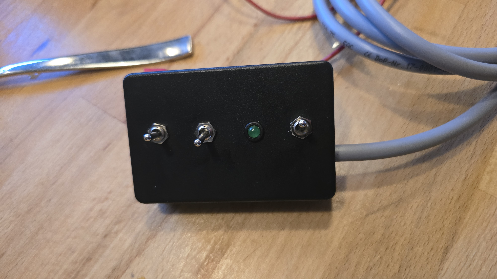

# Bedienteil – Verdrahtung (Eigenbau) & ESP-Anbindung

> ⚠️ **REVISION / ACHTUNG (in Klärung):** Aus dem klaren Gesamtplan
> (`images/schaltplan-komplett-klar.jpg`) ergibt sich: Der **B-Stecker trägt
> nicht nur Bedienteil-Signale**. Verifiziert per Aderverfolgung:
> - **B2 = rote Ader = G1 (Reed/Geschwindigkeit)**
> - **B3 = blaue Ader = G2 (zweite Reed-Ader)**
> - B1/B4/B5/B6 (schwarz) → T6/T8/T4 … (eigentliche Bedienteil-Signale)
>
> Damit ist die **untenstehende Tabelle (pin2=Masse usw.) überholt** und muss
> neu erstellt werden. Vermutlich ist die Nummerierung der Eigenbau-Box ≠ der
> B-Nummerierung im Plan. **Endgültige Belegung per Multimeter abgleichen**
> (Box-Pins ↔ Plan-Klemmen), bevor etwas angeschlossen wird.

Eigenbau-Bedienteil: schwarzes Gehäuse mit **3 Kippschaltern + grüner LED**.
Fotos unter [`images/bedienteil/`](images/bedienteil).

## Schaltprinzip

**Geschaltete Masse** (vom Nutzer ermittelt): jeder Schalter verbindet seine
Signalader mit der gemeinsamen Masse-Ader. Das Steuergerät hat interne Pull-ups;
gedrückt = Ader auf Masse gezogen.

➡️ **Konsequenz für die ESP-Box: normale Optokoppler genügen, kein PhotoMOS nötig.**

## Adernbelegung (6-adriges Kabel)

| Ader | Funktion | angeschlossen an |
|------|----------|------------------|
| **1** | Kippschalter **ein/aus** | Schalter 1 |
| **2** | **gemeinsame Masse** (alle 3 Schalter + LED-Rückleiter) | — |
| **3** | **LED** (Status „bereit") | direkt an LED |
| **4** | **RESUME** | mittlerer Taster |
| **5** | **ACC** (hoch / schneller) | Taster mit Mittelstellung |
| **6** | **DEC** (runter / langsamer) | Taster mit Mittelstellung |

> Quelle: Beschreibung des Nutzers + Innenfotos. **Noch mit Multimeter zu bestätigen:**
> (1) Ader 2 = wirklich Fahrzeugmasse? (2) ACC/DEC-Richtung (Ader 5 ↔ 6 ggf. tauschen).

## ESP-Parallelbox – Anbindung

Der ESP paralleliert die Taster, indem er die jeweilige Signalader gegen Ader 2
(Masse) zieht – je ein **Optokoppler** pro Kanal:

| ESP-Kanal | schaltet/liest | Wirkung |
|-----------|----------------|---------|
| Ausgang (Opto) | Ader 4 ↔ Ader 2 | RESUME |
| Ausgang (Opto) | Ader 5 ↔ Ader 2 | ACC (schneller) |
| Ausgang (Opto) | Ader 6 ↔ Ader 2 | DEC (langsamer) |
| Eingang (Opto) | Ader 3 ↔ Ader 2 | LED mitlesen → Status „bereit" |
| — | Ader 1 (ein/aus) | bleibt manuell (ESP fasst nicht an) |

**Vorteil:** Die exakte S/T-Klemmenzuordnung am Steuergerät wird für den
Parallel-Betrieb **nicht** benötigt – der ESP klemmt direkt an die 6
Bedienteil-Adern und ahmt die Taster nach. Brems-/Geschwindigkeitssignal liest
der ESP wie in [`architektur.md`](architektur.md) beschrieben zusätzlich mit.
