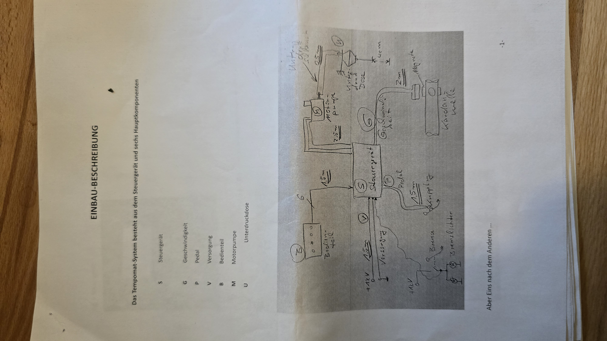
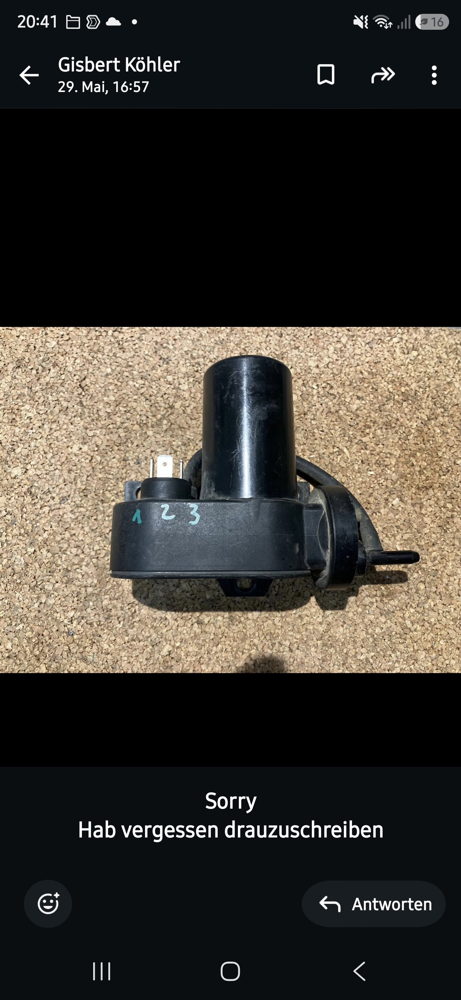
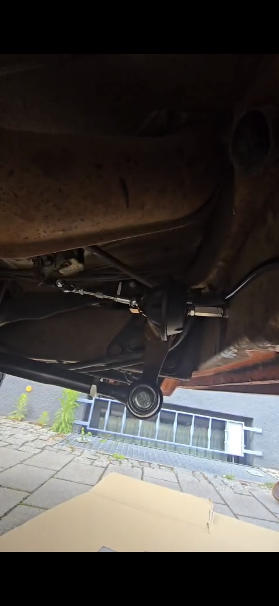
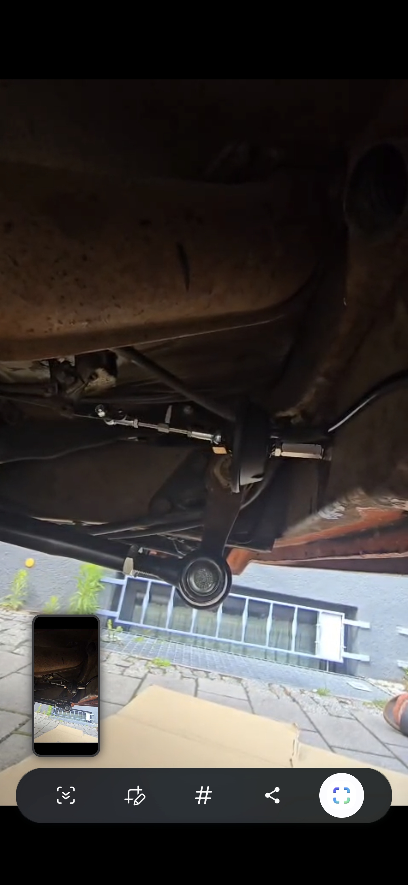
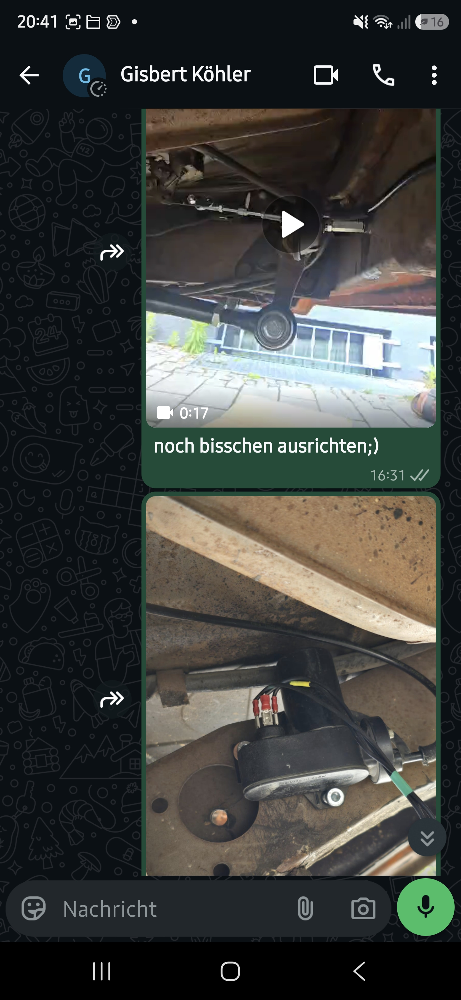

# VDO Tempomat – Einbau-Beschreibung (Original-Handbuch)

Abfotografiertes Original-Handbuch („EINBAU-BESCHREIBUNG", GK / Januar 2026).
Bilder unter [`images/handbuch/`](images/handbuch), Einbaufotos unter
[`images/einbau/`](images/einbau).

## Systemüberblick (Seite 1)

Das Tempomat-System besteht aus dem **Steuergerät** und sechs Hauptkomponenten:

| Kürzel | Komponente |
|--------|-----------|
| **S/Stg** | Steuergerät |
| **G** | Geschwindigkeit (Aufnehmer) |
| **P** | Pedal (Kupplung) |
| **V** | Versorgung |
| **B** | Bedienteil |
| **M** | Motorpumpe |
| **U** | Unterdruckdose |

## Komponenten (Seiten 2–4)

- **G = Geschwindigkeitsaufnehmer:** Magnete werden an der **Kardanwelle**
  angebracht, der Sensor in **5–10 mm** Abstand. (Reed-Sensor, Typ siehe Seite 11.)
- **P = Pedal:** Sensor + Anschraub-Magnet am **Kupplungspedal**. Bei Fahrzeug mit
  **Automatikgetriebe** wird stattdessen eine **elektrische Brücke** gesetzt.
- **M = Motorpumpe:** erzeugt den nötigen Unterdruck für das Stellglied
  (= die Unterdruckdose) und **belüftet über ein Ventil** bei Bedarf wieder.
- **U = Unterdruckdose:** wird vom Unterdruck zusammengezogen (**Wirkweg ca.
  30–38 mm**) und geht bei Belüftung/Druckabfall durch die Federkraft des
  Gasgestänges in den Ursprungszustand zurück. Mechanische Verbindung zum
  Gasgestänge z. B. über einen **Seilzug**.

> **Korrektur zur früheren Annahme:** Es werden **sowohl M als auch U benutzt**.
> Die Unterdruckdose ist im Schaltplan nur deshalb ausgegraut, weil sie **rein
> pneumatisch** angeschlossen ist (kein elektrischer Anschluss). Die Motorpumpe
> (elektrisch, 3 Adern) erzeugt das Vakuum, die Unterdruckdose ist der Aktuator.

## Bedienteil – Funktionen (Seite 3) ⭐

Das Bedienteil hat vier Bedienelemente:

| | Element |
|---|---------|
| **A** | Kippschalter **ein/aus** |
| **B** | **LED** (Status) |
| **C** | **RESUME**-Taster |
| **D** | **Taster für ACC und DEC** (hoch = beschleunigen, runter = verzögern) |

Bedienung:
- Kippschalter auf **1** → **LED leuchtet** → Steuergerät ist bereit.
- **ACC** (hoch drücken & halten): beschleunigen; **loslassen** → Geschwindigkeit
  wird gehalten (= gesetzt).
- **DEC** (runter drücken & halten): verlangsamen; **loslassen** → Geschwindigkeit
  wird gehalten.
- **RES** (Taster kurz drücken): nach Bremsen/Kuppeln die vorher eingestellte
  Geschwindigkeit wieder aufnehmen. Auch nach Überhol-Gasgeben: kurz drücken →
  vorher eingestellte Geschwindigkeit wird nach Gas-Wegnehmen wieder angefahren.

> Das deckt sich mit dem geplanten Eigenbau-Bedienteil: Kippschalter (ein/aus,
> wird **nicht** vom ESP angefasst), ein 2-Wege-Taster ACC/DEC (= „Plus/Minus")
> und ein RESUME-Taster. Plus die Status-LED.

## Einbauschritte (Seiten 5–9)

- **Verdrahtungsplan (Seite 5):** „**blau an S8 / blau an S3 / rot an S1 / die
  schwarze Leitung mit der weissen Markierung kommt an T9**".
- **Schritt 2 (Seite 6):** Steuergerät platzieren, Magnete + Sensor an die
  Kardanwelle. Sensor 5–10 mm Abstand. *Einzelkomponenten-Test:* beim langsamen
  Drehen der Welle muss der Sensor öffnen/schließen (mit Durchgangsprüfer
  „durchklingeln"). Entfällt, wenn ein fahrzeugeigenes Tachosignal genutzt wird.
- **Schritt 3 (Seite 7):** Sensor + Anschraub-Magnet am Kupplungspedal. Bei
  unbetätigtem Pedal muss der Sensor geschlossen sein.
- **Schritt 4 (Seite 7):** 12-V-Versorgung über **Kl. 15 (Zündung)**. Bremslicht-
  signal **hinter dem Bremslichtschalter** abnehmen. **Bremslichter müssen i. O.
  sein und es dürfen keine LED-Heckleuchten verbaut sein → es müssen Glühlampen sein!**
- **Schritt 5 (Seite 8):** Bedienteil anschließen (**sechs Adern**).
- **Schritt 6 (Seite 8):** Motorpumpe anschließen (**3 Adern**).
- **Schritt 7 (Seite 9):** Unterdruckschlauch Motorpumpe ↔ Unterdruckdose verbinden.
- **Schritt 8 (Seite 9):** Mechanische Verbindung zum Gasgestänge (Bowdenzug,
  geradlinig, „um die Kurve" mit Umhüllung – gibt's im Fahrrad-Laden).

### Einzelkomponenten-Test Unterdruckdose (Seite 9) ⭐
Motorpumpe **Pin 3 = +12 V**, dann:
| Bedingung | Unterdruckdose |
|-----------|----------------|
| **Pin 1 + 2 an Masse** | **ZIEHT AN** |
| **nur Pin 1 an Masse** | **HÄLT** |
| weder Pin 1 noch Pin 2 an Masse | **GIBT FREI** |

→ Motorpumpe: **Pin 3 = +12 V**, **Pin 1 & Pin 2 = die beiden Ventile/Pumpe**
(Anziehen / Halten / Freigeben). Passt zu M1/M2/M3 im Schaltplan.

## Bedienung / Betrieb (Seite 10)

- Zündung an → Kippschalter auf 1 → LED an → bereit.
- Geschwindigkeit lässt sich in der Regel ab **ca. 30–40 km/h** setzen.
- ACC/DEC drücken & halten → beschleunigen/verzögern; loslassen → halten.
- **Auskuppeln/Bremsen** entspannt den Gaszug (Tempomat gibt frei).
- Ebenso entspannt bei: Abschalten über I/O-Schalter, **Stromausfall**,
  **Undichtigkeit** im System, oder **Geschwindigkeitsabfall um ca. 10 km/h** (z. B. Bergfahrt).

## Tipps & Daten (Seite 11)

- Empfehlung: System vorab komplett **elektrisch auf der Werkbank testen**
  („Trockenübung") – Fehlersuche am stehenden Fahrzeug ist viel einfacher.
- **Impulserzeugung zum Testen:** 4 Magnete anbringen, Bohrmaschine auf
  mind. **1.000 U/min** (→ erzeugt das Tachosignal fürs Testen).
- **Reed-Sensor-Typ (Geschwindigkeit):** **WEDER WG04-1A66B-500W S2/2**.
- ⚠️ Wichtig (vom Schaltplan): **Mindestfrequenz Tachosignal 65 Hz** – erst ab
  da lässt sich die Geschwindigkeit setzen.

## Einbaufotos (vom Fahrzeug)

-  – Pin-Beschriftung der Motorpumpe.
-  – Stellglied am Unterboden mit Seilzug zum Gasgestänge.
-  – Sensor an der Kardanwelle.
- 
