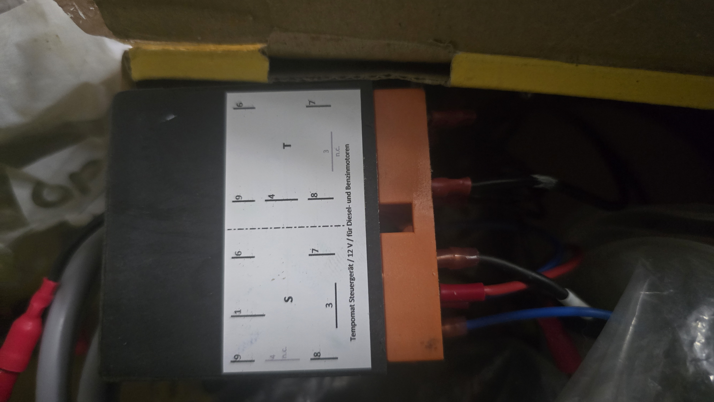
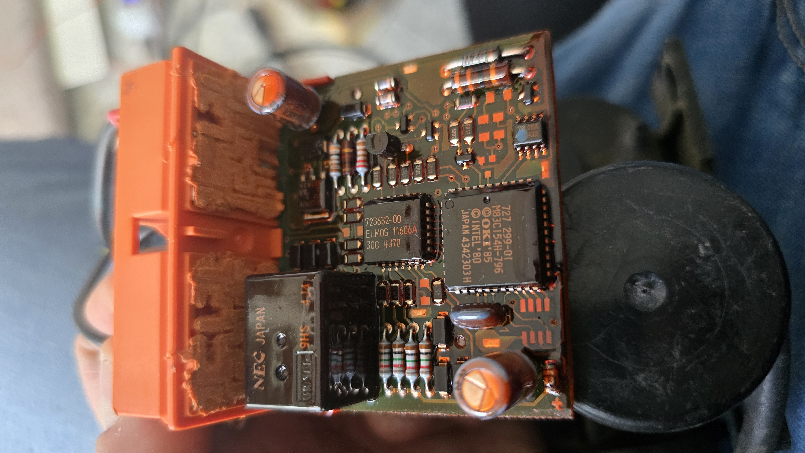
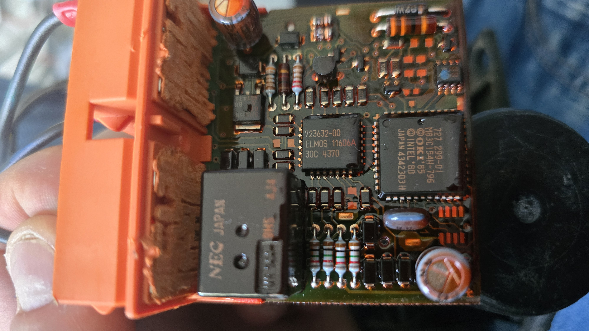
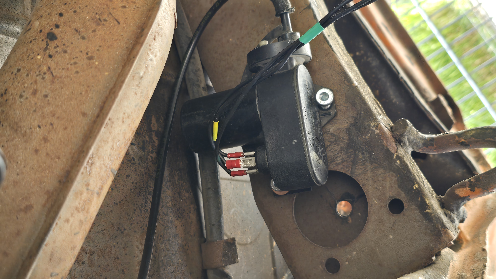
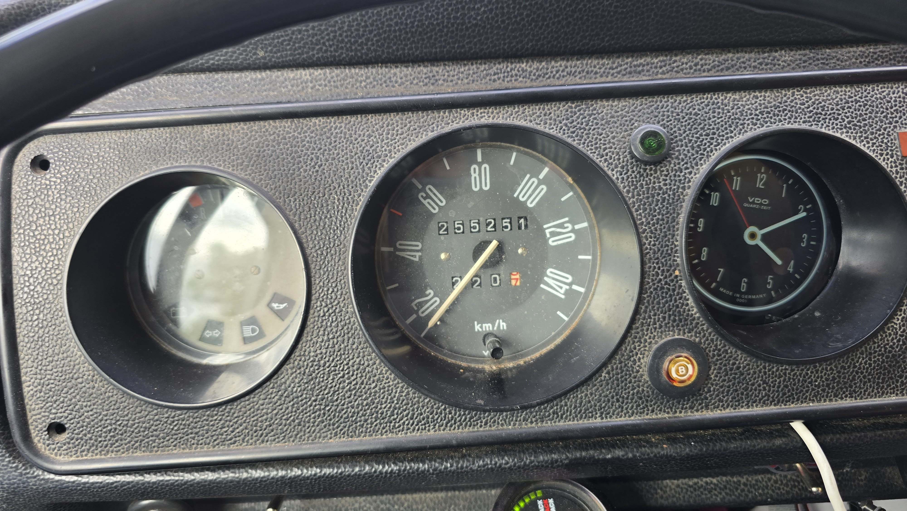
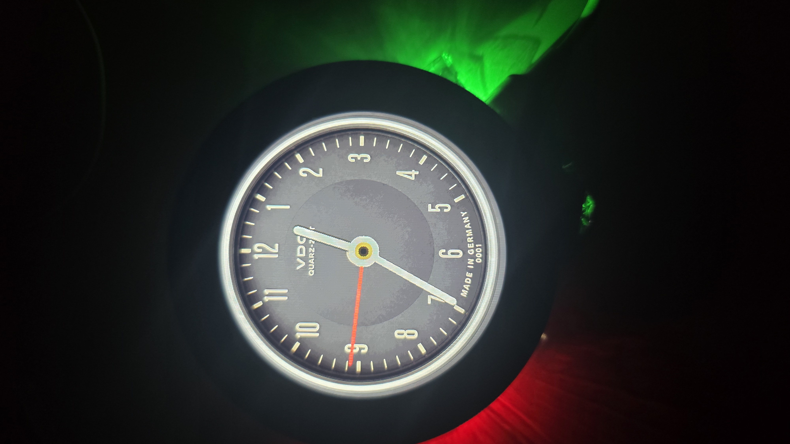
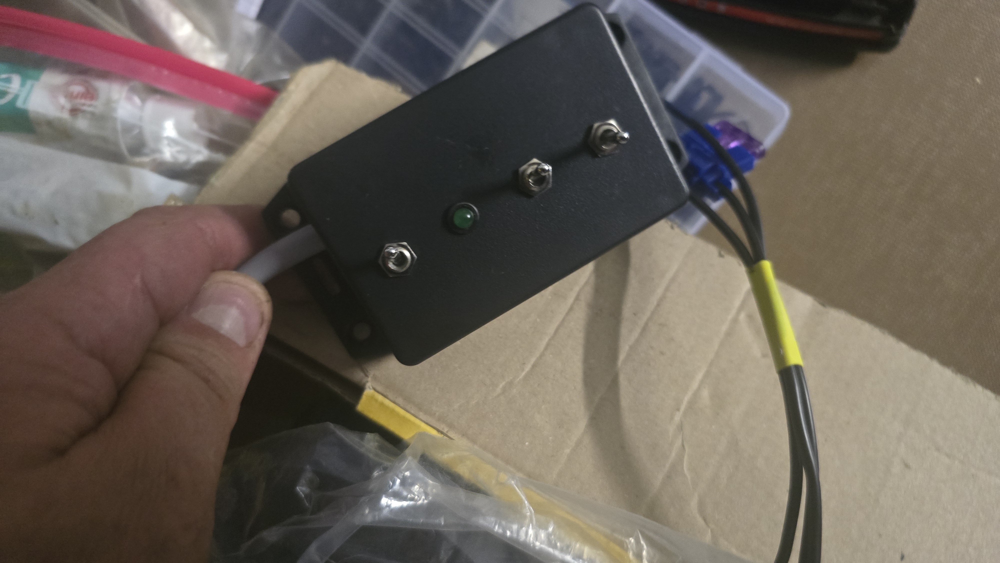

# Hardware-Dokumentation – VDO Tempomat

Ziel des Projekts: Das alte VDO-Tempomat-Steuergerät an den CAN-Bus anbinden
und über ein Touch-Display steuern.

## Komponenten

### Steuergerät (VDO Tempomat)
- Aufkleber: „Tempomat Steuergerät / 12 V / für Diesel- und Benzinmotoren"
- Anschlüsse: 1–9, 16, 17; aufgeteilt in Blöcke **S** und **T**
- Platine bestückt mit:
  - ELMOS ASIC `723632-00` (`ELMOS 11606A`, `30C 4370`)
  - Mikrocontroller `727 299-01` (OKI / Intel '85, `JAPAN 434230 H`)
  - NEC-Relais (Japan)
  - Elektrolytkondensatoren
- 
- 
- 

### Unterdruck-Stellglied (Vacuum-Aktuator)
- Im Motorraum / am Fahrgestell montiert
- Betätigt mechanisch das Gasgestänge per Unterdruck
- 

### Kombiinstrument / Fahrzeug
- Älterer Transporter/LKW, Tacho-Stand ~255.251 km
- VDO Quarz-Uhr im Cluster
- 
- 

### Bediengehäuse (selbstgebaut)
- Gehäuse mit Kippschaltern und grüner Status-LED
- 

## Offen / TODO
- [ ] Schaltplan (Verkabelung Steuergerät ↔ Stellglied ↔ Geschwindigkeitssignal) – wird noch nachgereicht
- [ ] Pinbelegung S/T-Block dokumentieren (Lesbarkeit prüfen)
- [ ] CAN-Anbindung konzipieren
- [ ] Touch-Display-Steuerung konzipieren
