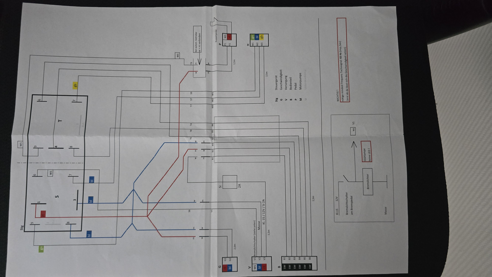
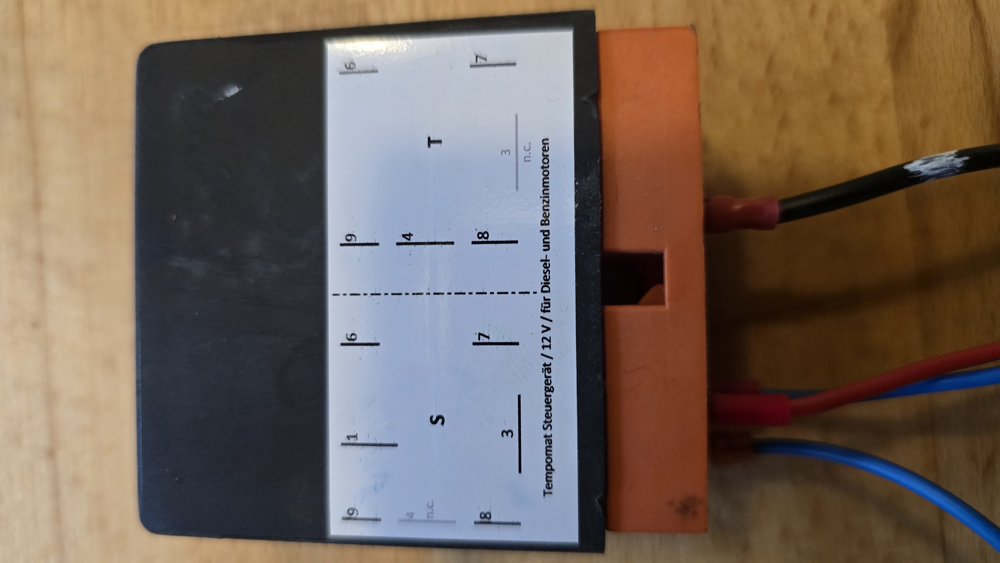
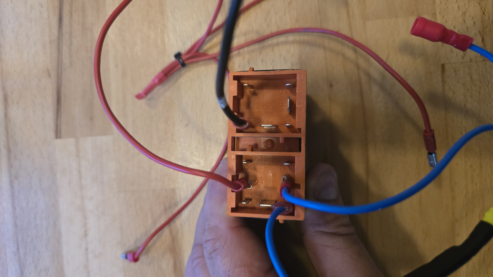
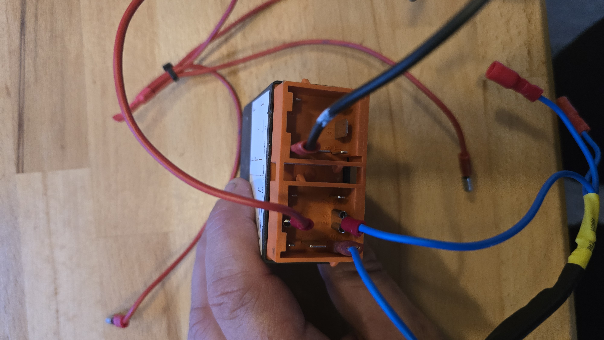

# Schaltplan – VDO Tempomat (entschlüsselt)

Quelle: 
(Details: [Detail 1](images/schaltplan-detail-1.jpg), [Detail 2](images/schaltplan-detail-2.jpg))

## Legende (Kürzel im Plan)

| Kürzel | Bedeutung |
|--------|-----------|
| **Stg** | Steuergerät (die VDO-Einheit) |
| **G** | Geschwindigkeit (Tacho-/Geschwindigkeitssignal) |
| **V** | Versorgung (Strom) |
| **B** | Bedienteil (Schalter) |
| **P** | Pedal (Kuppelpedal) |
| **M** | Motorpumpe (elektrisches Stellglied) |
| **U** | Unterdruckdose – *im Plan ausgegraut, weil rein pneumatisch (kein E-Anschluss)* |

> **Wichtig (korrigiert):** Es werden **sowohl Motorpumpe (M) als auch
> Unterdruckdose (U)** benutzt. Die **Motorpumpe** (elektrisch, 3 Adern) erzeugt
> das Vakuum, die **Unterdruckdose** (rein pneumatisch, deshalb im E-Plan
> ausgegraut) ist der eigentliche Aktuator am Gasgestänge. Details + Test-Tabelle
> der Ventile siehe [`handbuch.md`](handbuch.md).

## Stecker / Pinbelegung (Drahtfarben)

### G – Geschwindigkeit (2,0 m)
| Pin | Farbe | Funktion |
|-----|-------|----------|
| G1 | rt (rot) | Geschwindigkeitssignal |
| G2 | bl (blau) | Geschwindigkeitssignal |

### V – Versorgung (1,5 m)
| Pin | Farbe | Funktion |
|-----|-------|----------|
| V1 | ws (weiß) | → Bremslichtschalter (Bremssignal, siehe unten) |
| V2 | bl (blau) | Masse |
| V3 | rt (rot) | **Kl. 15 / 12 V / Sicherung 2 A** (zündungsgeschaltetes Plus) |

### B – Bedienteil (Schalter)
| Pin | Farbe |
|-----|-------|
| B1…B6 | alle SW (schwarz) |

→ 6 Adern zum Steuergerät. **Bedienteil-Funktionen** (aus dem Handbuch, Seite 3):
**A)** Kippschalter ein/aus · **B)** LED · **C)** RESUME-Taster · **D)** Taster
ACC/DEC (hoch = beschleunigen, runter = verzögern). Die exakte Zuordnung
**welche der 6 Adern welche Funktion** ist, muss noch durch Tracen im
Schaltplan + Messen bestätigt werden (siehe offene Punkte).

**Verdrahtungs-Hinweis aus dem Handbuch (Seite 5):**
„blau an S8 / blau an S3 / rot an S1 / die schwarze Leitung mit der weissen
Markierung kommt an T9". (Bezieht sich auf Versorgung/Bedienteil – beim Tracen berücksichtigen.)

### P – Pedal / Kuppelpedal (1,5 m)
| Pin | Farbe | Funktion |
|-----|-------|----------|
| P1 | ws (weiß) | Kupplungsschalter |
| P2 | rt (rot) | Kupplungsschalter |

> Hinweis im Plan: **„bei autom. Getriebe w + m verbinden"** – bei Automatik
> die weiße und braune Ader brücken (kein Kupplungssignal nötig).

### M – Motorpumpe / Stellglied (2,5 m)
| Pin | Farbe |
|-----|-------|
| M1 | gn (grün) |
| M2 | bl (blau) |
| M3 | gb (gelb) |

### Steuergerät-Anschlüsse
Das Steuergerät hat zwei Steckerblöcke **S** und **T** (deckt sich mit dem
Aufkleber auf dem Gerät). Klemmen S1–S9 bzw. T3–T9, teils n.c. (not connected).
Die Adern von G/V/B/P/M laufen auf diese Klemmen.

Fotos des realen Geräts + orangem Stecker mit Klemmenbeschriftung:
- 
- 
- 

## Bremssignal (kritisch)

```
Kl.15 (12V) ──[Bremslichtschalter am Bremspedal]──┬── Bremslichter ── Masse
                                                  └── V1 (ws) → Steuergerät
```

- **V1 (weiß) = Bremssignal, ACTIVE HIGH:** beim Bremsen liegt **+12 V** auf V1
  → Steuergerät kuppelt aus (Reset). Das beantwortet die Polaritätsfrage:
  **gebremst = +12 V auf V1.**
- 🔴 **Wichtiger Plan-Hinweis: „Glühlampe – keine LED!"**
  Die Bremslichter **müssen Glühlampen** sein, keine LED. Die Erkennung braucht
  den Stromfluss/Last über den Glühfaden; mit LED funktioniert das Bremssignal nicht.

### Fahrzeugseite: T2b Bremslicht-System (ab 08/1975)

Fahrzeug = VW T2b. Doppeltes Bremslicht-System mit **2× 3-poligem
Bremslichtschalter** am Bremskraftverstärker und einer Kontrollleuchte
(Überwachung).

Kontrollleuchte (4-polig):
| Anschluss | Farbe | Funktion |
|---|---|---|
| 15 | schwarz | +12 V über Zündung |
| K | rot | Signal von beiden Bremslichtschaltern (Überwachung) |
| 61 | blau | D+ Lichtmaschine → Lampentest beim Einschalten |
| 31 | braun | Masse |

Je Bremslichtschalter (3-polig):
| Klemme | Funktion |
|---|---|
| 82a | +12 V von Sicherung (Dauerplus, Eingang) |
| **81** | **Ausgang zu den Bremsleuchten** (nur beim Bremsen +12 V) |
| 81a | rote Leitung zur Kontrollleuchte K (Überwachung) |

**Anschluss des Tempomat-Bremssignals:**
- **V1 (weiß) → Klemme 81** (gemeinsamer Bremslicht-Strang beider Schalter).
  Beim Bremsen +12 V mit Glühlampen-Last dahinter.
- Abgriff dort, wo **beide** 81-Ausgänge zusammenlaufen → Redundanz bleibt
  erhalten (fällt ein Schalter aus, liefert der andere weiter +12 V).
- **Nicht** 82a verwenden (Dauerplus). Nicht mit 81a (Überwachung) verwechseln.
- ESP-Bremseingang ebenfalls an 81 (= V1), Optokoppler, +12 V = gebremst.
  Optional 81a/K mitlesen → Diagnose eines defekten Bremsschalters.
- 61 (D+) und 15/31 sind nur für die Lampenüberwachung, **für den Tempomat
  nicht nötig**.

## Geschwindigkeitssignal (kritisch)

🔴 **Plan-Hinweis: „nötige mindest Frequenz Tachosignal: 65 Hz (Imp./sec)
(erst ab da lässt sich die Geschwindigkeit setzen)".**

- Unter 65 Hz lässt sich der Tempomat **nicht** aktivieren.
- Für unser ESP-Mithören heißt das: Eingangsstufe muss sauber bis in diesen
  Frequenzbereich zählen; und der Tempomat ist erst ab der zu 65 Hz gehörenden
  Geschwindigkeit setzbar (relevant fürs Zielanfahren).

## Bedeutung für den Parallel-Ansatz (ESP-Inline-Box)

Anzuzapfende Leitungen:

| Zweck | Leitung(en) | Polarität / Hinweis |
|-------|-------------|---------------------|
| Taster mitschalten/lesen | **B1–B6** (schwarz) | Funktion je Pin noch klären |
| Geschwindigkeit mitlesen | **G1/G2** | Frequenzsignal, min. 65 Hz |
| Bremse mitlesen | **V1** (weiß) | **+12 V = gebremst** (active high) |
| Strom für Box | **V3** (Kl.15, +12 V) / **V2** (Masse) | über 2 A abgesichert |

> Stellglied (M) und Kupplung (P) werden vom ESP **nicht** angefasst – bleibt
> alles beim VDO.

## Offene Punkte

- [ ] **B1–B6 → Funktion** sicher zuordnen (Set / Resume / + / − / Ein-Aus / Masse).
      Am besten: Original-VDO-Bedienteil ausmessen **oder** VDO-Typnummer nennen,
      dann Pinbelegung recherchieren.
- [ ] B-Kontakte messen: schalten gegen **Masse** oder **+12 V**? (→ Opto vs. PhotoMOS)
- [ ] Tacho-Impulskonstante bestimmen (Hz ↔ km/h), Bezug zu den 65 Hz.
