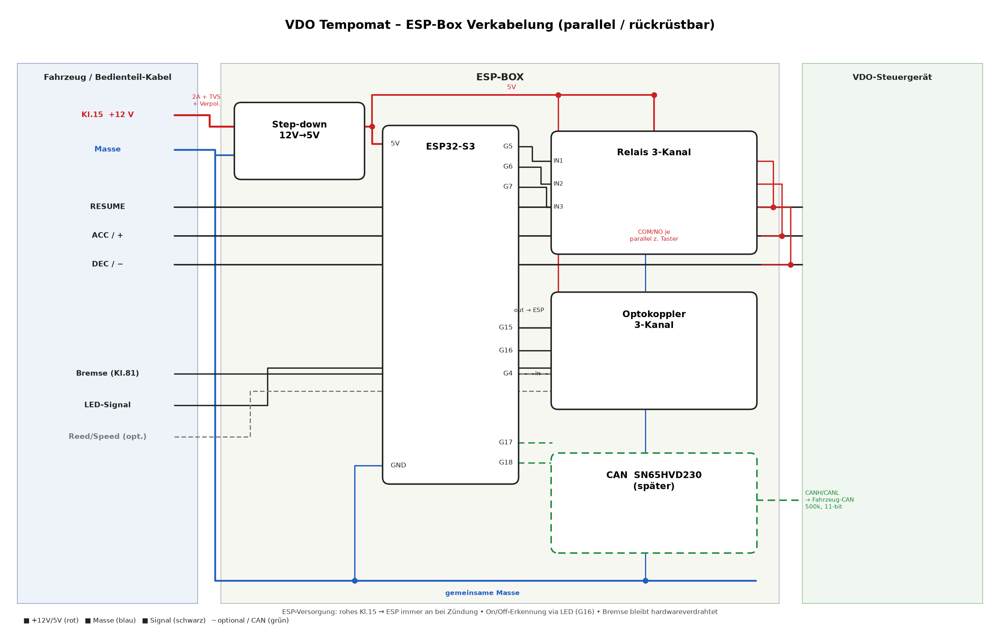

# Verkabelungsplan – ESP-Box (Inline / parallel)

Fertige Module, lötfrei: **ESP32-S3 (44P) auf Terminal-Adapter**, **12 V→5 V Step-down**,
**Relais-Modul (≥3 Kanal)**, **Optokoppler-Modul (≥3 Kanal)**, später **CAN SN65HVD230**.

Pins: siehe `esp32-pinbelegung.md`. Klemmen am VDO: `klemmenliste.md`.
Bedienteil-Adern (Set/Resume/+/−): `bedienteil-verdrahtung.md`.

## Übersicht

```
  Bedienteil-/VDO-Kabel              ESP-BOX                         VDO-Steuergerät
  ─────────────────────   ┌────────────────────────────────┐   ───────────────────
                          │                                 │
  Kl.15 +12V ───[Si 2A]──►│ Step-down 12V→5V ──► ESP 5V     │
  Masse ─────────────────►│ gemeinsame Masse ──► ESP GND    │
                          │                                 │
  Taster-Adern  ◄────────►│ Relais (3x)  COM/NO parallel    │◄──── selbe Adern gehen
  (RESUME/ACC/DEC)        │   zum jeweiligen Taster          │      1:1 weiter zum VDO
                          │                                 │
  Bremse (Kl.81) ────────►│ Optokoppler ──► GPIO15          │
  LED-Signal ────────────►│ Optokoppler ──► GPIO16          │
  Reed (optional) ───────►│ Optokoppler ──► GPIO4           │
                          │                                 │
                          │ GPIO17/18 ──► SN65HVD230 ──► CANH/CANL (später)
                          └────────────────────────────────┘
```
> **Wired-OR-Prinzip:** Alle Original-Adern laufen **unverändert** zum VDO weiter.
> Die ESP-Box **zapft nur parallel an** – Original bleibt voll funktionsfähig.

## 1) Stromversorgung
```
Kl.15 +12V (am Bedienteil) ──[Sicherung 2 A]──[TVS 15–18V ↯GND]──► Step-down  IN+
Masse ───────────────────────────────────────────────────────────► Step-down  IN−
Step-down OUT 5V ──► ESP "5V"   und  ► Relais-Modul VCC  und ► Opto-Modul VCC(Logik)
Step-down OUT GND ─► ESP "GND"  +  alle Modul-GND  +  Fahrzeugmasse  (GEMEINSAM!)
ESP "3V3" (vom Board) ─► optional Logikseite Opto/CAN
```
- **GEWÄHLT: 12 V von rohem Kl. 15** (Dauer-Zündungsplus, am Bedienteil) → der **ESP
  läuft immer, wenn die Zündung an ist** (Display/WiFi immer erreichbar).
- **On/Off NICHT über den Strom**: der ESP erkennt „Tempomat an/aus" am **LED-Signal (GPIO16)**.
- **TVS-Diode** (z. B. SMBJ16A) + **Verpolschutz** (Serien-Diode/P-FET) am Eingang empfohlen.
- ⚠️ **Reglerwahl:** Das vorhandene AMS1117-Board (Aufdruck „Eingang < 12 V") ist **linear**
  und **nicht für Kl.15 geeignet** (Bordnetz ~14,4 V + Spitzen → Überspannung; zudem Hitze).
  Nur für **Bench-Test** nutzen. Für den **Festeinbau: echter Schalt-Buck mit weitem Eingang**
  (z. B. **MP1584EN / LM2596**, 8–40 V → 5 V) direkt von Kl.15.

## 2) Tasten „drücken" – Relais parallel zu den Tastern
Jeder Relais-Kontakt **COM/NO** liegt **parallel über den jeweiligen Taster**
(Signalader ↔ gemeinsame Taster-Masse). ESP zieht GPIO HIGH → Relais zu → „gedrückt".
```
ESP GPIO5 ──► Relais IN1 ;  Relais1 COM/NO ── parallel über RESUME-Taster
ESP GPIO6 ──► Relais IN2 ;  Relais2 COM/NO ── parallel über ACC/PLUS-Kontakt  (Set = kurzer Tipp)
ESP GPIO7 ──► Relais IN3 ;  Relais3 COM/NO ── parallel über DEC/MINUS-Kontakt
Relais-Modul: VCC=5V, GND=gemeinsam, IN aktiv-HIGH/-LOW je nach Board (in Firmware setzen)
```
> Exakte Bedienteil-Adern je Funktion erst per Multimeter bestätigen
> (siehe `bedienteil-verdrahtung.md`), dann Relais dort parallel klemmen.

## 3) Signale lesen – Optokoppler (PC817-Modul, 1 Kanal/Board)
Modul-Pinout: **INPUT (+ / −)** = Signalseite · **OUTPUT (VCC / OUT / GND)** = ESP-Seite.
Pro Signal **ein Modul** → also 2–3 Stück (Bremse, LED, opt. Reed).
```
OUTPUT-Seite (immer):  VCC→3V3 ,  GND→gemeinsame Masse ,  OUT→ESP-GPIO (interner Pull-up AN)
INPUT-Seite:
  Bremse (Kl.81,+12V) → INPUT+ ;  Masse → INPUT−     ;  OUT → GPIO15
  LED "bereit" (Ader3)→ INPUT+ ;  Masse → INPUT−     ;  OUT → GPIO16   (Polarität prüfen)
  Reed/Speed (opt.)   → INPUT+ ;  Masse → INPUT−     ;  OUT → GPIO4 (Interrupt)
```
- **Active-LOW:** Signal an → Opto leuchtet → OUT = LOW (in Firmware invertieren).
- **12 V am Eingang:** Vorwiderstand R1 prüfen; bei reinem 3,3/5-V-Board ~1 kΩ Serienwiderstand ergänzen.
- Reed in SW entprellen.
- **Bremse = höchste Priorität:** erkannt → ESP bricht jede Automatik sofort ab (Sperrzeit).
- **Geschwindigkeit primär per WiFi vom Spartan-Hub** – GPIO4-Reed nur als lokaler Fallback.

## 4) CAN (später)
```
ESP GPIO17 (TX) ──► SN65HVD230 TXD
ESP GPIO18 (RX) ──◄ SN65HVD230 RXD
SN65HVD230 VCC=3V3, GND gemeinsam ;  CANH/CANL ──► Fahrzeug-CAN (500 kbit/s, 11-bit)
```

## Sicherheits-/Bau-Regeln
- **Bremse bleibt hardwareverdrahtet** zum VDO – ESP liest nur mit, sitzt **nicht** im Bremspfad.
- **Eine gemeinsame Masse** für ESP + alle Module + Step-down + VDO – sonst schaltet nichts.
- Relais-Variante = galvanisch getrennt (empfohlen). MOSFET-Variante: zusätzlich TVS je Signal.
- Alles parallel → **jederzeit rückrüstbar** (ESP-Box abziehen = Originalzustand).

## Modul-Zuordnung & Stückzahl (vorhanden: 8 Opto, 10 MOSFET)

**Ausgänge „drücken" → 3 MOSFET-Module** (von 10):
| MOSFET | schaltet (Drain/OUT) | nach (Source) | Trigger ← ESP |
|--------|----------------------|---------------|----------------|
| 1 | Ader 4 = RESUME (B4) | Ader 2 = Masse | GPIO5 |
| 2 | Ader 5 = ACC/+  (B5) | Ader 2 = Masse | GPIO6 |
| 3 | Ader 6 = DEC/−  (B6) | Ader 2 = Masse | GPIO7 |
> MOSFET-Modul: Trigger-Seite VCC/GND/SIG → ESP (3,3 V triggert IRLZ44N). Last-Seite:
> Signalader an **Drain**, Masse an **Source** (Drain/Source am Modul kurz durchmessen).
> Gemeinsame Masse Pflicht; pro Signal eine **TVS** empfohlen.

**Eingänge „lesen" → 2–3 Optokoppler** (von 8):
| Opto | INPUT+ | INPUT− | OUTPUT → ESP |
|------|--------|--------|--------------|
| 1 | Bremse (Kl.81, +12 V) | Masse | OUT→GPIO15, VCC→3V3, GND→Masse |
| 2 | LED „bereit" (Ader 3) | Masse | OUT→GPIO16, VCC→3V3, GND→Masse |
| 3 *(optional)* | Reed/Speed | Masse | OUT→GPIO4, VCC→3V3, GND→Masse |
> Active-LOW (Signal an → OUT LOW, in SW invertieren). 12 V-Eingang: R1 prüfen.

**Summe nötig:** 3 MOSFET + 2 Opto (Pflicht) bzw. +1 Opto mit lokalem Reed. Reserve reichlich.

## Schaltplan-Bild



> Generiert mit `verkabelung-esp-diagram.py` (matplotlib) – editierbar/regenerierbar.
